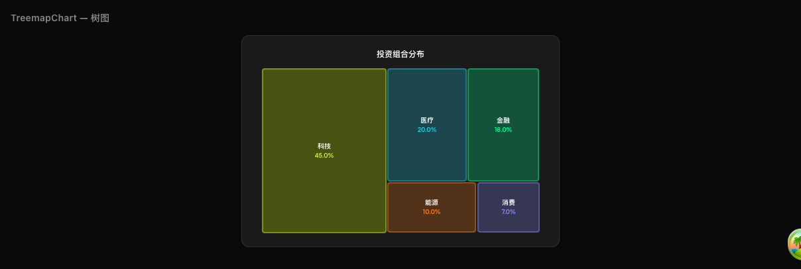
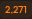

# Edgen 图表参考示例

> 所有图表类型的完整 JSON 示例、JSON Schema 与选型参考。
>
> 📖 设计新图表请参考主文档：[chart-design-guide.md](./chart-design-guide.md)

---

## 目录

- [图表类型总览](#图表类型总览)
- [各图表建议数据量](#各图表建议数据量)
- **基础统计类**：[BarChart](#barchart--柱状图) · [LineChart](#linechart--折线图) · [PieChart](#piechart--饼图) · [StatCallout](#statcallout--数据卡片) · [StatGrid](#statgrid--数据网格)
- **对比分析类**：[ComparisonBar](#comparisonbar--前后对比) · [VersusChart](#versuschart--对决对比) · [DumbbellChart](#dumbbellchart--哑铃图) · [LollipopChart](#lollipopchart--棒棒糖图)
- **排名与分布类**：[RankingBar](#rankingbar--排行榜) · [FunnelChart](#funnelchart--漏斗图) · [TreemapChart](#treemapchart--树图) · [BenchmarkHeatmap](#benchmarkheatmap--基准热力图)
- **流程与关系类**：[FlowDiagram](#flowdiagram--流程图) · [TimelineDiagram](#timelinediagram--时间线) · [SankeyChart](#sankeychart--桑基图) · [NetworkGraph](#networkgraph--网络关系图)
- **高级分析类**：[WaterfallChart](#waterfallchart--瀑布图) · [GaugeChart](#gaugechart--仪表盘) · [QuadrantMatrix](#quadrantmatrix--四象限矩阵) · [SensitivityChart](#sensitivitychart--敏感性分析)

---

## 图表类型总览

| 类别 | 图表类型 | 一句话描述 | 核心字段 |
|---|---|---|---|
| **基础统计** | BarChart | 不同类别的数值比较 | `values[{label, value}]` |
| | LineChart | 时间趋势变化 | `values[{label, value}]`, `comparison?` |
| | PieChart | 整体各部分占比 | `segments[{label, value}]` |
| | StatCallout | 突出单个关键指标 | `value`, `comparison?` |
| | StatGrid | 同时展示多个关键指标 | `stats[{label, value}]` |
| **对比分析** | ComparisonBar | 两个状态的前后对比 | `before{label,value}`, `after{label,value}` |
| | VersusChart | 两实体多维度对比 | `entityA`, `entityB`, `metrics[]` |
| | DumbbellChart | 多类别范围变化 | `dumbbellPoints[{label, start, end}]` |
| | LollipopChart | 突出特定项的对比 | `lollipopItems[{label, value, highlight?}]` |
| **排名与分布** | RankingBar | 有序排名 | `items[{label, value}]` |
| | FunnelChart | 转化漏斗 | `funnelStages[{label, value}]` |
| | TreemapChart | 层级占比 | `treemapItems[{label, value}]` |
| | BenchmarkHeatmap | 多实体多维度评分 | `dimensions[]`, `benchmarkEntities[]` |
| **流程与关系** | FlowDiagram | 线性流程步骤 | `stages[{label, stat?, sublabel?}]` |
| | TimelineDiagram | 事件时间线 | `events[{date, label, impact?}]` |
| | SankeyChart | 资金/流量流向 | `nodes[]`, `links[]` |
| | NetworkGraph | 实体关系网络 | `networkNodes[]`, `networkEdges[]` |
| **高级分析** | WaterfallChart | 累积增减变化 | `items[{label, value, type}]` |
| | GaugeChart | 指标在范围中的位置 | `value`, `max`, `context?` |
| | QuadrantMatrix | 二维空间定位 | `xAxis`, `yAxis`, `quadrantEntities[]` |
| | SensitivityChart | 变量变化影响分析 | `inputLabel`, `sensitivityEntities[]` |

---

## 各图表建议数据量

| 图表 | 最小 | 推荐 | 最大 |
|---|---|---|---|
| BarChart | 3 项 | 4-6 项 | 8 项 |
| LineChart | 4 点 | 6-8 点 | 12 点 |
| PieChart | 3 扇区 | 4-5 扇区 | 6 扇区 |
| RankingBar | 3 项 | 5-7 项 | 10 项 |
| VersusChart | 3 维度 | 4-5 维度 | 6 维度 |
| FunnelChart | 3 阶段 | 4-5 阶段 | 6 阶段 |
| NetworkGraph | 3 节点 | 4-6 节点 | 8 节点 |
| BenchmarkHeatmap | 3×3 | 3-4×4-5 | 5×6 |
| SankeyChart | 4 节点 | 5-6 节点 | 8 节点 |
| TreemapChart | 4 块 | 5-6 块 | 8 块 |

---

## 完整示例与 JSON Schema

> 每个图表包含：一句话描述、截图、JSON 示例数据、chartData 的 JSON Schema。

### 基础统计类

### BarChart — 柱状图

展示不同类别的数值比较。


<details>
<summary>JSON 示例</summary>

```json
{
  "root": "chart",
  "elements": {
    "chart": {
      "type": "BarChart",
      "props": {
        "chartData": {
          "type": "BarChart",
          "label": "2024年各季度营收",
          "values": [
            { "label": "Q1'24", "value": 12.5 },
            { "label": "Q2'24", "value": 14.8 },
            { "label": "Q3'24", "value": 16.2 },
            { "label": "Q4'24", "value": 18.1 }
          ],
          "unit": "$B"
        }
      },
      "children": []
    }
  }
}
```

</details>

<details>
<summary>JSON Schema</summary>

```json
{
  "type": "object",
  "required": ["type", "label", "values"],
  "properties": {
    "type": { "type": "string", "const": "BarChart" },
    "label": { "type": "string" },
    "unit": { "type": "string" },
    "values": {
      "type": "array",
      "items": {
        "type": "object",
        "required": ["label", "value"],
        "properties": {
          "label": { "type": "string" },
          "value": { "type": "number" }
        }
      },
      "minItems": 3,
      "maxItems": 8
    }
  }
}
```

</details>

---

### LineChart — 折线图

展示时间趋势变化。


<details>
<summary>JSON 示例</summary>

```json
{
  "root": "chart",
  "elements": {
    "chart": {
      "type": "LineChart",
      "props": {
        "chartData": {
          "type": "LineChart",
          "label": "月活跃用户趋势",
          "values": [
            { "label": "Jan", "value": 120 },
            { "label": "Feb", "value": 135 },
            { "label": "Mar", "value": 158 },
            { "label": "Apr", "value": 192 },
            { "label": "May", "value": 210 }
          ],
          "unit": "K",
          "comparison": "+75% in 5 months"
        }
      },
      "children": []
    }
  }
}
```

</details>

<details>
<summary>JSON Schema</summary>

```json
{
  "type": "object",
  "required": ["type", "label", "values"],
  "properties": {
    "type": { "type": "string", "const": "LineChart" },
    "label": { "type": "string" },
    "unit": { "type": "string" },
    "comparison": { "type": "string" },
    "values": {
      "type": "array",
      "items": {
        "type": "object",
        "required": ["label", "value"],
        "properties": {
          "label": { "type": "string" },
          "value": { "type": "number" }
        }
      },
      "minItems": 4,
      "maxItems": 12
    }
  }
}
```

</details>

---

### PieChart — 饼图

展示整体中各部分的占比。


<details>
<summary>JSON 示例</summary>

```json
{
  "root": "chart",
  "elements": {
    "chart": {
      "type": "PieChart",
      "props": {
        "chartData": {
          "type": "PieChart",
          "label": "市场份额分布",
          "segments": [
            { "label": "Apple", "value": 42 },
            { "label": "Samsung", "value": 28 },
            { "label": "Xiaomi", "value": 15 },
            { "label": "Others", "value": 15 }
          ]
        }
      },
      "children": []
    }
  }
}
```

</details>

<details>
<summary>JSON Schema</summary>

```json
{
  "type": "object",
  "required": ["type", "label", "segments"],
  "properties": {
    "type": { "type": "string", "const": "PieChart" },
    "label": { "type": "string" },
    "segments": {
      "type": "array",
      "items": {
        "type": "object",
        "required": ["label", "value"],
        "properties": {
          "label": { "type": "string" },
          "value": { "type": "number", "minimum": 0 }
        }
      },
      "minItems": 3,
      "maxItems": 6
    }
  }
}
```

</details>

---

### StatCallout — 数据卡片

突出展示单个关键指标。


<details>
<summary>JSON 示例</summary>

```json
{
  "root": "chart",
  "elements": {
    "chart": {
      "type": "StatCallout",
      "props": {
        "chartData": {
          "type": "StatCallout",
          "label": "总融资额",
          "value": "$47.5B",
          "comparison": "+23% vs 2023"
        }
      },
      "children": []
    }
  }
}
```

</details>

<details>
<summary>JSON Schema</summary>

```json
{
  "type": "object",
  "required": ["type", "label", "value"],
  "properties": {
    "type": { "type": "string", "const": "StatCallout" },
    "label": { "type": "string" },
    "value": { "type": "string" },
    "comparison": { "type": "string" }
  }
}
```

</details>

---

### StatGrid — 数据网格

同时展示多个关键指标。


<details>
<summary>JSON 示例</summary>

```json
{
  "root": "chart",
  "elements": {
    "chart": {
      "type": "StatGrid",
      "props": {
        "chartData": {
          "type": "StatGrid",
          "label": "公司核心指标",
          "stats": [
            { "value": "$12.5B", "label": "市值" },
            { "value": "23.5%", "label": "毛利率" },
            { "value": "1,280", "label": "员工数" },
            { "value": "4.2x", "label": "P/E 比率" }
          ]
        }
      },
      "children": []
    }
  }
}
```

</details>

<details>
<summary>JSON Schema</summary>

```json
{
  "type": "object",
  "required": ["type", "label", "stats"],
  "properties": {
    "type": { "type": "string", "const": "StatGrid" },
    "label": { "type": "string" },
    "stats": {
      "type": "array",
      "items": {
        "type": "object",
        "required": ["label", "value"],
        "properties": {
          "label": { "type": "string" },
          "value": { "type": "string" }
        }
      },
      "minItems": 2,
      "maxItems": 6
    }
  }
}
```

</details>

---

## 对比分析类

### ComparisonBar — 前后对比

展示两个状态的前后对比。


<details>
<summary>JSON 示例</summary>

```json
{
  "root": "chart",
  "elements": {
    "chart": {
      "type": "ComparisonBar",
      "props": {
        "chartData": {
          "type": "ComparisonBar",
          "label": "用户留存率变化",
          "before": { "label": "优化前", "value": 32 },
          "after": { "label": "优化后", "value": 58 },
          "unit": "%"
        }
      },
      "children": []
    }
  }
}
```

</details>

<details>
<summary>JSON Schema</summary>

```json
{
  "type": "object",
  "required": ["type", "label", "before", "after"],
  "properties": {
    "type": { "type": "string", "const": "ComparisonBar" },
    "label": { "type": "string" },
    "unit": { "type": "string" },
    "before": {
      "type": "object",
      "required": ["label", "value"],
      "properties": {
        "label": { "type": "string" },
        "value": { "type": "number" }
      }
    },
    "after": {
      "type": "object",
      "required": ["label", "value"],
      "properties": {
        "label": { "type": "string" },
        "value": { "type": "number" }
      }
    }
  }
}
```

</details>

---

### VersusChart — 对决对比

两个实体在多个维度的全面对比。


<details>
<summary>JSON 示例</summary>

```json
{
  "root": "chart",
  "elements": {
    "chart": {
      "type": "VersusChart",
      "props": {
        "chartData": {
          "type": "VersusChart",
          "label": "Tesla vs BYD 对比",
          "entityA": { "name": "Tesla", "ticker": "TSLA" },
          "entityB": { "name": "BYD", "ticker": "BYD" },
          "metrics": [
            { "label": "营收", "valueA": 96.7, "valueB": 84.9, "unit": "$B" },
            { "label": "交付量", "valueA": 1.8, "valueB": 3.0, "unit": "M" },
            { "label": "毛利率", "valueA": 18.2, "valueB": 20.1, "unit": "%" }
          ]
        }
      },
      "children": []
    }
  }
}
```

</details>

<details>
<summary>JSON Schema</summary>

```json
{
  "type": "object",
  "required": ["type", "label", "entityA", "entityB", "metrics"],
  "properties": {
    "type": { "type": "string", "const": "VersusChart" },
    "label": { "type": "string" },
    "entityA": {
      "type": "object",
      "required": ["name"],
      "properties": {
        "name": { "type": "string" },
        "ticker": { "type": "string" }
      }
    },
    "entityB": {
      "type": "object",
      "required": ["name"],
      "properties": {
        "name": { "type": "string" },
        "ticker": { "type": "string" }
      }
    },
    "metrics": {
      "type": "array",
      "items": {
        "type": "object",
        "required": ["label", "valueA", "valueB"],
        "properties": {
          "label": { "type": "string" },
          "valueA": { "type": "number" },
          "valueB": { "type": "number" },
          "unit": { "type": "string" }
        }
      },
      "minItems": 3,
      "maxItems": 6
    }
  }
}
```

</details>

---

### DumbbellChart — 哑铃图

展示多个类别的范围变化。


<details>
<summary>JSON 示例</summary>

```json
{
  "root": "chart",
  "elements": {
    "chart": {
      "type": "DumbbellChart",
      "props": {
        "chartData": {
          "type": "DumbbellChart",
          "label": "各部门薪资范围 (万元/年)",
          "dumbbellPoints": [
            { "label": "工程", "start": 30, "end": 80 },
            { "label": "产品", "start": 25, "end": 65 },
            { "label": "设计", "start": 20, "end": 55 },
            { "label": "运营", "start": 18, "end": 45 }
          ]
        }
      },
      "children": []
    }
  }
}
```

</details>

<details>
<summary>JSON Schema</summary>

```json
{
  "type": "object",
  "required": ["type", "label", "dumbbellPoints"],
  "properties": {
    "type": { "type": "string", "const": "DumbbellChart" },
    "label": { "type": "string" },
    "unit": { "type": "string" },
    "dumbbellPoints": {
      "type": "array",
      "items": {
        "type": "object",
        "required": ["label", "start", "end"],
        "properties": {
          "label": { "type": "string" },
          "start": { "type": "number" },
          "end": { "type": "number" }
        }
      },
      "minItems": 2,
      "maxItems": 8
    }
  }
}
```

</details>

---

### LollipopChart — 棒棒糖图

突出特定项的对比。


<details>
<summary>JSON 示例</summary>

```json
{
  "root": "chart",
  "elements": {
    "chart": {
      "type": "LollipopChart",
      "props": {
        "chartData": {
          "type": "LollipopChart",
          "label": "各产品线满意度评分",
          "lollipopItems": [
            { "label": "产品 A", "value": 92, "highlight": true },
            { "label": "产品 B", "value": 85 },
            { "label": "产品 C", "value": 78 },
            { "label": "产品 D", "value": 71 }
          ]
        }
      },
      "children": []
    }
  }
}
```

</details>

<details>
<summary>JSON Schema</summary>

```json
{
  "type": "object",
  "required": ["type", "label", "lollipopItems"],
  "properties": {
    "type": { "type": "string", "const": "LollipopChart" },
    "label": { "type": "string" },
    "unit": { "type": "string" },
    "lollipopItems": {
      "type": "array",
      "items": {
        "type": "object",
        "required": ["label", "value"],
        "properties": {
          "label": { "type": "string" },
          "value": { "type": "number" },
          "highlight": { "type": "boolean", "default": false }
        }
      },
      "minItems": 3,
      "maxItems": 8
    }
  }
}
```

</details>

---

## 排名与分布类

### RankingBar — 排行榜

有序排名展示。


<details>
<summary>JSON 示例</summary>

```json
{
  "root": "chart",
  "elements": {
    "chart": {
      "type": "RankingBar",
      "props": {
        "chartData": {
          "type": "RankingBar",
          "label": "全球 AI 芯片市场份额",
          "items": [
            { "label": "NVIDIA", "value": 80, "unit": "%" },
            { "label": "AMD", "value": 10, "unit": "%" },
            { "label": "Intel", "value": 5, "unit": "%" },
            { "label": "Others", "value": 5, "unit": "%" }
          ]
        }
      },
      "children": []
    }
  }
}
```

</details>

<details>
<summary>JSON Schema</summary>

```json
{
  "type": "object",
  "required": ["type", "label", "items"],
  "properties": {
    "type": { "type": "string", "const": "RankingBar" },
    "label": { "type": "string" },
    "items": {
      "type": "array",
      "items": {
        "type": "object",
        "required": ["label", "value"],
        "properties": {
          "label": { "type": "string" },
          "value": { "type": "number" },
          "unit": { "type": "string" }
        }
      },
      "minItems": 3,
      "maxItems": 10
    }
  }
}
```

</details>

---

### FunnelChart — 漏斗图

展示转化漏斗。


<details>
<summary>JSON 示例</summary>

```json
{
  "root": "chart",
  "elements": {
    "chart": {
      "type": "FunnelChart",
      "props": {
        "chartData": {
          "type": "FunnelChart",
          "label": "电商转化漏斗",
          "funnelStages": [
            { "label": "浏览商品", "value": 50000 },
            { "label": "加入购物车", "value": 12000 },
            { "label": "开始结算", "value": 5600 },
            { "label": "完成支付", "value": 3200 }
          ]
        }
      },
      "children": []
    }
  }
}
```

</details>

<details>
<summary>JSON Schema</summary>

```json
{
  "type": "object",
  "required": ["type", "label", "funnelStages"],
  "properties": {
    "type": { "type": "string", "const": "FunnelChart" },
    "label": { "type": "string" },
    "funnelStages": {
      "type": "array",
      "items": {
        "type": "object",
        "required": ["label", "value"],
        "properties": {
          "label": { "type": "string" },
          "value": { "type": "number", "minimum": 0 }
        }
      },
      "minItems": 3,
      "maxItems": 6
    }
  }
}
```

</details>

---

### TreemapChart — 树图

展示层级结构中各部分的占比。



<details>
<summary>JSON 示例</summary>

```json
{
  "root": "chart",
  "elements": {
    "chart": {
      "type": "TreemapChart",
      "props": {
        "chartData": {
          "type": "TreemapChart",
          "label": "投资组合分布",
          "treemapItems": [
            { "label": "科技", "value": 45 },
            { "label": "医疗", "value": 20 },
            { "label": "金融", "value": 18 },
            { "label": "能源", "value": 10 },
            { "label": "消费", "value": 7 }
          ]
        }
      },
      "children": []
    }
  }
}
```

</details>

<details>
<summary>JSON Schema</summary>

```json
{
  "type": "object",
  "required": ["type", "label", "treemapItems"],
  "properties": {
    "type": { "type": "string", "const": "TreemapChart" },
    "label": { "type": "string" },
    "treemapItems": {
      "type": "array",
      "items": {
        "type": "object",
        "required": ["label", "value"],
        "properties": {
          "label": { "type": "string" },
          "value": { "type": "number", "minimum": 0 }
        }
      },
      "minItems": 4,
      "maxItems": 8
    }
  }
}
```

</details>

---

### BenchmarkHeatmap — 基准热力图

多实体多维度评分对比。


<details>
<summary>JSON 示例</summary>

```json
{
  "root": "chart",
  "elements": {
    "chart": {
      "type": "BenchmarkHeatmap",
      "props": {
        "chartData": {
          "type": "BenchmarkHeatmap",
          "label": "AI 模型能力对比",
          "dimensions": ["推理", "编码", "创意写作", "数学", "多语言"],
          "benchmarkEntities": [
            { "label": "GPT-4o", "scores": [92, 88, 90, 85, 91], "overall": 89 },
            { "label": "Claude 3.5", "scores": [90, 92, 88, 82, 87], "overall": 88 },
            { "label": "Gemini", "scores": [85, 80, 82, 88, 90], "overall": 85 }
          ]
        }
      },
      "children": []
    }
  }
}
```

</details>

<details>
<summary>JSON Schema</summary>

```json
{
  "type": "object",
  "required": ["type", "label", "dimensions", "benchmarkEntities"],
  "properties": {
    "type": { "type": "string", "const": "BenchmarkHeatmap" },
    "label": { "type": "string" },
    "dimensions": {
      "type": "array",
      "items": { "type": "string" },
      "minItems": 3,
      "maxItems": 6
    },
    "benchmarkEntities": {
      "type": "array",
      "items": {
        "$ref": "#/$defs/BenchmarkEntity"
      },
      "minItems": 3,
      "maxItems": 5
    }
  },
  "$defs": {
    "BenchmarkEntity": {
      "type": "object",
      "required": ["label", "scores", "overall"],
      "properties": {
        "label": { "type": "string" },
        "scores": {
          "type": "array",
          "items": { "type": "number" }
        },
        "overall": { "type": "number" }
      }
    }
  }
}
```

</details>

---

## 流程与关系类

### FlowDiagram — 流程图

展示线性流程或步骤序列。


<details>
<summary>JSON 示例</summary>

```json
{
  "root": "chart",
  "elements": {
    "chart": {
      "type": "FlowDiagram",
      "props": {
        "chartData": {
          "type": "FlowDiagram",
          "label": "用户注册流程",
          "stages": [
            { "label": "访问落地页", "stat": "10,000 UV" },
            { "label": "点击注册", "sublabel": "转化率 32%", "stat": "3,200" },
            { "label": "填写信息", "sublabel": "完成率 78%", "stat": "2,496" },
            { "label": "注册完成", "stat": "2,271" }
          ]
        }
      },
      "children": []
    }
  }
}
```

</details>

<details>
<summary>JSON Schema</summary>

```json
{
  "type": "object",
  "required": ["type", "label", "stages"],
  "properties": {
    "type": { "type": "string", "const": "FlowDiagram" },
    "label": { "type": "string" },
    "stages": {
      "type": "array",
      "items": {
        "type": "object",
        "required": ["label"],
        "properties": {
          "label": { "type": "string" },
          "sublabel": { "type": "string" },
          "stat": { "type": "string" }
        }
      },
      "minItems": 2,
      "maxItems": 6
    }
  }
}
```

</details>

---

### TimelineDiagram — 时间线

展示事件的时间顺序。



<details>
<summary>JSON 示例</summary>

```json
{
  "root": "chart",
  "elements": {
    "chart": {
      "type": "TimelineDiagram",
      "props": {
        "chartData": {
          "type": "TimelineDiagram",
          "label": "产品发布里程碑",
          "events": [
            { "date": "2024-Q1", "label": "MVP 上线", "impact": "首批 1000 用户" },
            { "date": "2024-Q2", "label": "A 轮融资", "impact": "$5M" },
            { "date": "2024-Q3", "label": "国际化上线", "impact": "覆盖 5 个市场" },
            { "date": "2025-Q1", "label": "突破 10 万用户" }
          ]
        }
      },
      "children": []
    }
  }
}
```

</details>

<details>
<summary>JSON Schema</summary>

```json
{
  "type": "object",
  "required": ["type", "label", "events"],
  "properties": {
    "type": { "type": "string", "const": "TimelineDiagram" },
    "label": { "type": "string" },
    "events": {
      "type": "array",
      "items": {
        "type": "object",
        "required": ["date", "label"],
        "properties": {
          "date": { "type": "string" },
          "label": { "type": "string" },
          "impact": { "type": "string" }
        }
      },
      "minItems": 2,
      "maxItems": 8
    }
  }
}
```

</details>

---

### SankeyChart — 桑基图

展示流量或资金在节点之间的流向。


<details>
<summary>JSON 示例</summary>

```json
{
  "root": "chart",
  "elements": {
    "chart": {
      "type": "SankeyChart",
      "props": {
        "chartData": {
          "type": "SankeyChart",
          "label": "营收来源与支出分配",
          "nodes": [
            { "id": "ads", "label": "广告收入" },
            { "id": "sub", "label": "订阅收入" },
            { "id": "rd", "label": "研发" },
            { "id": "mkt", "label": "营销" },
            { "id": "ops", "label": "运营" }
          ],
          "links": [
            { "source": "ads", "target": "rd", "value": 30 },
            { "source": "ads", "target": "mkt", "value": 25 },
            { "source": "sub", "target": "rd", "value": 20 },
            { "source": "sub", "target": "ops", "value": 15 }
          ],
          "unit": "$M"
        }
      },
      "children": []
    }
  }
}
```

</details>

<details>
<summary>JSON Schema</summary>

```json
{
  "type": "object",
  "required": ["type", "label", "nodes", "links"],
  "properties": {
    "type": { "type": "string", "const": "SankeyChart" },
    "label": { "type": "string" },
    "unit": { "type": "string" },
    "nodes": {
      "type": "array",
      "items": {
        "type": "object",
        "required": ["id", "label"],
        "properties": {
          "id": { "type": "string" },
          "label": { "type": "string" }
        }
      },
      "minItems": 4,
      "maxItems": 8
    },
    "links": {
      "type": "array",
      "items": {
        "type": "object",
        "required": ["source", "target", "value"],
        "properties": {
          "source": { "type": "string" },
          "target": { "type": "string" },
          "value": { "type": "number", "minimum": 0 }
        }
      }
    }
  }
}
```

</details>

---

### NetworkGraph — 网络关系图

展示实体之间的关系网络。


<details>
<summary>JSON 示例</summary>

```json
{
  "root": "chart",
  "elements": {
    "chart": {
      "type": "NetworkGraph",
      "props": {
        "chartData": {
          "type": "NetworkGraph",
          "label": "AI 行业竞争格局",
          "networkNodes": [
            { "id": "openai", "label": "OpenAI", "tier": 1, "type": "company", "highlight": true },
            { "id": "msft", "label": "Microsoft", "tier": 1, "type": "company" },
            { "id": "google", "label": "Google", "tier": 1, "type": "company" },
            { "id": "anthropic", "label": "Anthropic", "tier": 2, "type": "company" }
          ],
          "networkEdges": [
            { "from": "msft", "to": "openai", "type": "invests", "label": "$13B", "strength": 3 },
            { "from": "google", "to": "anthropic", "type": "invests", "label": "$2B", "strength": 2 },
            { "from": "openai", "to": "google", "type": "competes", "strength": 3 }
          ]
        }
      },
      "children": []
    }
  }
}
```

</details>

<details>
<summary>JSON Schema</summary>

```json
{
  "type": "object",
  "required": ["type", "label", "networkNodes", "networkEdges"],
  "properties": {
    "type": { "type": "string", "const": "NetworkGraph" },
    "label": { "type": "string" },
    "networkNodes": {
      "type": "array",
      "items": {
        "$ref": "#/$defs/NetworkNode"
      },
      "minItems": 3,
      "maxItems": 8
    },
    "networkEdges": {
      "type": "array",
      "items": {
        "$ref": "#/$defs/NetworkEdge"
      }
    }
  },
  "$defs": {
    "NetworkNode": {
      "type": "object",
      "required": ["id", "label"],
      "properties": {
        "id": { "type": "string" },
        "label": { "type": "string" },
        "tier": { "type": "integer" },
        "type": { "type": "string" },
        "highlight": { "type": "boolean", "default": false }
      }
    },
    "NetworkEdge": {
      "type": "object",
      "required": ["from", "to", "type", "strength"],
      "properties": {
        "from": { "type": "string" },
        "to": { "type": "string" },
        "type": { "type": "string" },
        "label": { "type": "string" },
        "strength": { "type": "integer", "minimum": 1, "maximum": 3 }
      }
    }
  }
}
```

</details>

---

## 高级分析类

### WaterfallChart — 瀑布图

展示从起始值到最终值的累积变化。


<details>
<summary>JSON 示例</summary>

```json
{
  "root": "chart",
  "elements": {
    "chart": {
      "type": "WaterfallChart",
      "props": {
        "chartData": {
          "type": "WaterfallChart",
          "label": "利润构成分解",
          "items": [
            { "label": "总营收", "value": 100, "type": "total" },
            { "label": "成本", "value": -45, "type": "negative" },
            { "label": "运营费", "value": -20, "type": "negative" },
            { "label": "其他收入", "value": 8, "type": "positive" },
            { "label": "净利润", "value": 43, "type": "result" }
          ],
          "unit": "$M"
        }
      },
      "children": []
    }
  }
}
```

</details>

<details>
<summary>JSON Schema</summary>

```json
{
  "type": "object",
  "required": ["type", "label", "items"],
  "properties": {
    "type": { "type": "string", "const": "WaterfallChart" },
    "label": { "type": "string" },
    "unit": { "type": "string" },
    "items": {
      "type": "array",
      "items": {
        "type": "object",
        "required": ["label", "value", "type"],
        "properties": {
          "label": { "type": "string" },
          "value": { "type": "number" },
          "type": {
            "type": "string",
            "enum": ["total", "positive", "negative", "result"]
          }
        }
      },
      "minItems": 3,
      "maxItems": 8
    }
  }
}
```

</details>

---

### GaugeChart — 仪表盘

展示某个指标在范围中的位置或进度。


<details>
<summary>JSON 示例</summary>

```json
{
  "root": "chart",
  "elements": {
    "chart": {
      "type": "GaugeChart",
      "props": {
        "chartData": {
          "type": "GaugeChart",
          "label": "服务器 CPU 使用率",
          "value": "73%",
          "max": 100,
          "context": "警戒线：85%"
        }
      },
      "children": []
    }
  }
}
```

</details>

<details>
<summary>JSON Schema</summary>

```json
{
  "type": "object",
  "required": ["type", "label", "value", "max"],
  "properties": {
    "type": { "type": "string", "const": "GaugeChart" },
    "label": { "type": "string" },
    "value": { "type": "string" },
    "max": { "type": "number" },
    "context": { "type": "string" }
  }
}
```

</details>

---

### QuadrantMatrix — 四象限矩阵

在二维空间中定位多个实体。


<details>
<summary>JSON 示例</summary>

```json
{
  "root": "chart",
  "elements": {
    "chart": {
      "type": "QuadrantMatrix",
      "props": {
        "chartData": {
          "type": "QuadrantMatrix",
          "label": "产品优先级矩阵",
          "xAxis": { "label": "用户影响力" },
          "yAxis": { "label": "开发成本" },
          "quadrantLabels": ["高影响低成本", "高影响高成本", "低影响低成本", "低影响高成本"],
          "quadrantEntities": [
            { "label": "功能 A", "x": 80, "y": 20, "highlight": true },
            { "label": "功能 B", "x": 85, "y": 75 },
            { "label": "功能 C", "x": 30, "y": 15 },
            { "label": "功能 D", "x": 25, "y": 80 }
          ]
        }
      },
      "children": []
    }
  }
}
```

</details>

<details>
<summary>JSON Schema</summary>

```json
{
  "type": "object",
  "required": ["type", "label", "xAxis", "yAxis", "quadrantLabels", "quadrantEntities"],
  "properties": {
    "type": { "type": "string", "const": "QuadrantMatrix" },
    "label": { "type": "string" },
    "xAxis": {
      "type": "object",
      "required": ["label"],
      "properties": { "label": { "type": "string" } }
    },
    "yAxis": {
      "type": "object",
      "required": ["label"],
      "properties": { "label": { "type": "string" } }
    },
    "quadrantLabels": {
      "type": "array",
      "items": { "type": "string" },
      "minItems": 4,
      "maxItems": 4
    },
    "quadrantEntities": {
      "type": "array",
      "items": {
        "$ref": "#/$defs/QuadrantEntity"
      },
      "minItems": 3,
      "maxItems": 8
    }
  },
  "$defs": {
    "QuadrantEntity": {
      "type": "object",
      "required": ["label", "x", "y"],
      "properties": {
        "label": { "type": "string" },
        "x": { "type": "number", "minimum": 0, "maximum": 100 },
        "y": { "type": "number", "minimum": 0, "maximum": 100 },
        "highlight": { "type": "boolean", "default": false }
      }
    }
  }
}
```

</details>

---

### SensitivityChart — 敏感性分析

展示一个变量变化对多个指标的影响程度。


<details>
<summary>JSON 示例</summary>

```json
{
  "root": "chart",
  "elements": {
    "chart": {
      "type": "SensitivityChart",
      "props": {
        "chartData": {
          "type": "SensitivityChart",
          "label": "利率敏感性分析",
          "inputLabel": "基准利率",
          "inputChange": "+100bps",
          "sensitivityEntities": [
            { "label": "房贷支出", "multiplier": 1.8 },
            { "label": "债券收益", "multiplier": 1.5 },
            { "label": "股票估值", "multiplier": -0.6 },
            { "label": "储蓄回报", "multiplier": 1.2 }
          ]
        }
      },
      "children": []
    }
  }
}
```

</details>

<details>
<summary>JSON Schema</summary>

```json
{
  "type": "object",
  "required": ["type", "label", "inputLabel", "inputChange", "sensitivityEntities"],
  "properties": {
    "type": { "type": "string", "const": "SensitivityChart" },
    "label": { "type": "string" },
    "inputLabel": { "type": "string" },
    "inputChange": { "type": "string" },
    "sensitivityEntities": {
      "type": "array",
      "items": {
        "type": "object",
        "required": ["label", "multiplier"],
        "properties": {
          "label": { "type": "string" },
          "multiplier": { "type": "number" }
        }
      },
      "minItems": 2,
      "maxItems": 6
    }
  }
}
```

</details>
